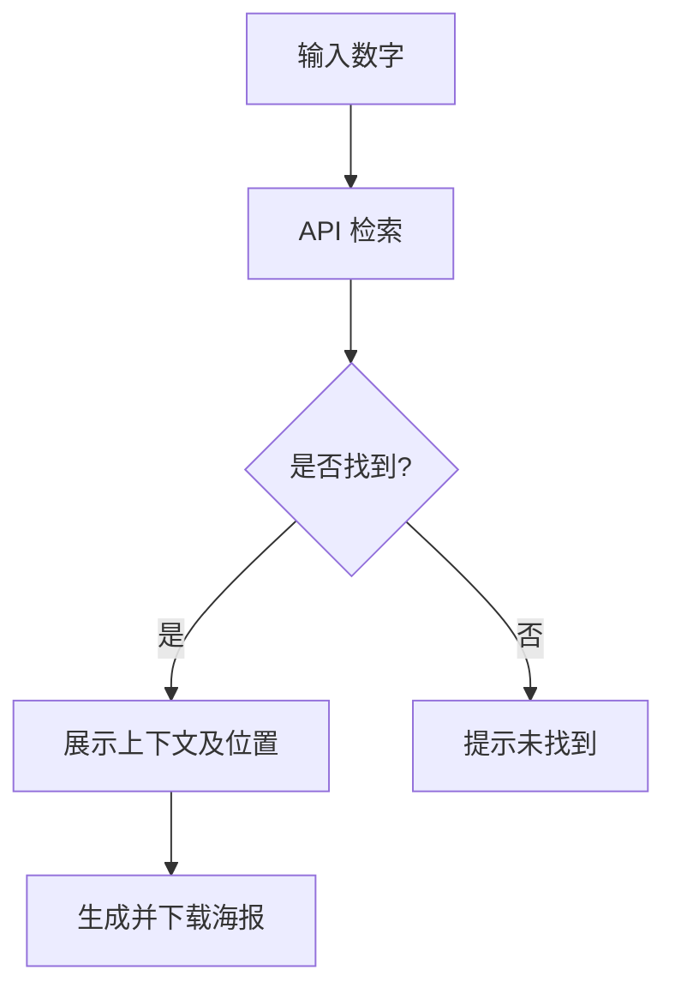

## 1. 产品概述
本项目是一个“圆周率纪念海报”网站。用户可以在无限不循环的圆周率（$\pi$）中寻找具有特殊意义的数字串（如8位数生日、纪念日等），并生成极具美感的专属纪念海报进行社交分享。
- 解决目前同类网站功能简陋、缺乏社交裂变能力、无法处理 8 位数高命中率的问题。
- 赋予冰冷的数学常量以“宇宙级浪漫”的情感价值。

## 2. 核心功能

### 2.1 功能模块
1. **首页 (Home)**：包含标题、浪漫文案、数字输入框（最多 8 位）、搜索按钮、查询状态展示。
2. **海报展示模块 (Poster Section)**：查询成功后，渲染带上下文的圆周率数字，并提供生成海报及下载功能。

### 2.2 页面详情
| 页面名称 | 模块名称 | 功能描述 |
|-----------|-------------|---------------------|
| 首页 | 搜索模块 | 接收用户输入的数字串，校验格式，发起极速检索。 |
| 首页 | 结果展示与海报 | 动态渲染检索结果（命中位置与前后文），通过前端技术（如 html2canvas）生成精美的纪念图片并提供下载。 |

## 3. 核心流程
用户进入网站 -> 输入 8 位以内数字 -> 点击搜索 -> 后端基于 O(1) 索引极速返回位置与上下文 -> 前端展示结果 -> 用户点击生成海报 -> 渲染并下载海报。

## 4. 用户界面设计

### 4.1 设计风格
- **主色调**：宇宙深邃蓝/暗夜星空黑背景，辅以星光白或浪漫金作为文字与高亮颜色。
- **字体**：数字部分使用具有科技感或优雅的等宽字体（Monospace/Serif 结合），正文使用现代无衬线字体。
- **按钮**：带有微光发光效果（Glow effect）或玻璃拟物化（Glassmorphism）风格，传达高级质感。
- **文案**：极具浪漫色彩，例如“在无限不循环的宇宙中，我们相遇在第 3,141,592 位”。

### 4.2 页面设计概述
| 页面名称 | 模块名称 | UI 元素 |
|-----------|-------------|-------------|
| 首页 | 英雄区域 | 星空/宇宙背景，居中的大字标题，精致的输入框和带微光的查询按钮。 |
| 首页 | 结果海报卡片 | 像一张实体纪念卡片一样，包含数字高亮排版、二维码、网站标识。 |

### 4.3 响应式设计
桌面端与移动端自适应，考虑到社交分享场景，移动端展示和排版优先级最高。
