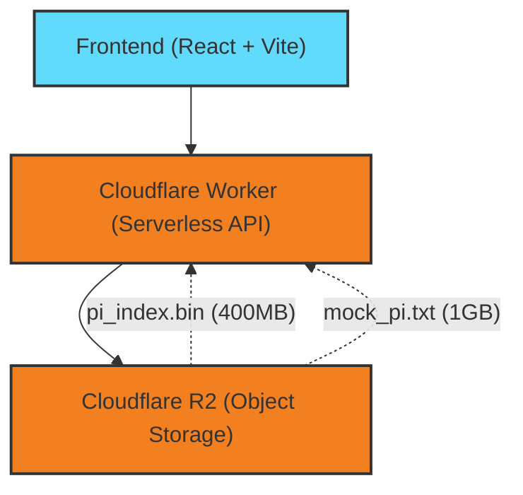
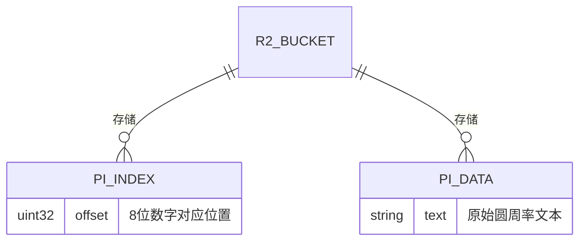

## 1. 架构设计


## 2. 技术说明
- **前端**: React@18 + tailwindcss@3 + vite
- **工具库**: html2canvas 或 dom-to-image (用于在用户设备本地渲染海报图片)。
- **后端**: Cloudflare Workers (轻量级 Serverless 接口)。
- **存储**: Cloudflare R2（存储原始圆周率文件及二进制索引文件）。
- **核心算法**: 采用 O(1) 二进制索引架构。Worker 收到请求后，通过精确计算偏移量并向 R2 发起两次极小字节的 `HTTP Range` 请求（一次拉取位置，一次拉取上下文），实现弱网下毫秒级响应，且避免内存溢出。

## 3. 路由定义
| 路由 | 目的 |
|-------|---------|
| `/` | 网站首页，包含搜索交互、结果展示和海报生成核心逻辑 |

## 4. API 定义
**GET /api/search?q={numbers}**
- **Request**: `q` (string, 1-8 位数字)
- **Response**:
```typescript
interface SearchResponse {
    found: boolean;
    position?: number; // 在圆周率中的小数位后位置
    context?: string;  // 包含目标数字的前后 20 位上下文
    searchStr?: string;
}
```

## 5. 存储与数据定义
### 5.1 数据模型定义


### 5.2 数据存储结构
- `pi_index.bin`: 预计算的二进制索引文件，大小固定为 400MB（1亿 * 4 Bytes）。
- `mock_pi.txt`: 原始圆周率文本文件（最终生产环境为 1GB 包含 10亿位小数的文本）。
